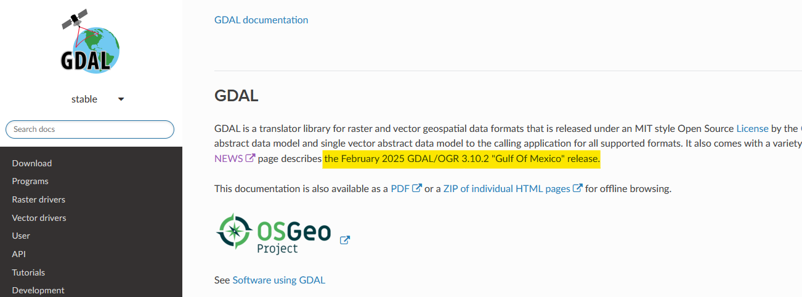

# Plan du cours


Illustrations dédiées à la séquence et manipulations en mode CLI de GDAL / OGR

- Rappels
- Manipulations de bases
- Le cas des MNT
- GDAL/OGR & PostGIS
- Création d'un script bash

--------------


**LA** documentation => https://gdal.org/en/stable/

L'actualité n'attend pas !




### Des exemples par la Pratique

*Les données sont à récupérer sur le réseau*

--------------

## Pratique des outils en ligne de commande / Illustration QGIS

Depuis debian WSL2 pour contexte linux.


### GDAL - La librairie des rasters


```bash
0...10...20...30...40...50...60...70...80...90...100 - done
```

Travail avec 4 images Ortho Toulouse centre historique Toulouse + une dalle éloignée


#### Information sur le Raster

> gdalinfo


```bash
gdalinfo ORT_2022_1574165_2269250.jp2
```

> gdalinfo sortie json

```bash
gdalinfo -json ORT_2022_1574165_2269250.jp2 > gdalinfo_ORT1.json
```


#### VRT

> Création d'un vrt

```bash
gdalbuildvrt assemble.vrt *.jp2
```
> vrt du mnt Aveyron

```bash
gdalbuildvrt BDALTI_12.vrt *.asc
```

> Gestion du nodata avec l'option srcnodata

```bash
gdalbuildvrt -srcnodata "0" assemble_srcnodata.vrt *.jp2
```


#### Changer de format

> Conversion d'un jp2 en tif

> [!WARNING]
> **Attention - Opération longue**

```bash
gdal_translate -of GTiff ORT_2022_1572415_2268000.jp2 ORT_2022_1572415_2268000.tif
```

#### Reprojection d'un raser

> Reprojection du 3943 au 4326

```bash
gdalwarp -s_srs EPSG:3943 -t_srs EPSG:4326 ORT_2022_1572415_2268000.jp2 ORT_2022_1572415_2268000_4326.jp2
```

> Reprojection du 3943 au 4326 avec gestion de la transparence :+1:

```bash
gdalwarp -s_srs EPSG:3943 -t_srs EPSG:4326 -dstalpha ORT_2022_1572415_2268000.jp2 ORT_2022_1572415_2268000_4326.jp2
```

> Oscultons le VRT 

Ligne 2 :

	"SRS dataAxisToSRSAxisMapping="1,2"-PROJCS["RGF93 v1 / CC43"]"

> Tentons de reprojeter ce VRT
```bash
gdalwarp -s_srs EPSG:3943 -t_srs EPSG:4326 -dstalpha assemble.vrt assemble_4326.vrt
```

On constate juste un changement et une rapidité d'éxécution incomparable
	
	"SRS dataAxisToSRSAxisMapping="2,1">GEOGCS["WGS 84",DATUM["WGS_1984"]"

#### Assembler des Rasters

> Lister les images du dossier courant
```bash
ls -1 *.asc > liste_asc.txt
```
> Merge des images avec la liste en entrée
```bash
gdal_merge.py -a_nodata 0 -o mosaic.tif --optfile liste_asc.txt
```

#### Découper un Raster

> avec une emprise (copie from qgis) 636 222  6 343 004 665 081  6 361 244

```bash
gdalwarp -s_srs EPSG:2154 -t_srs EPSG:2154 -te 636222  6343004 665081  6361244 -crop_to_cutline mosaic.tif mosaic_crop_emprise.tif
```

> avec un vecteur

```bash
gdalwarp  -s_srs EPSG:2154 -t_srs EPSG:2154 -cutline vecteur/DEPARTEMENT.shp -cl DEPARTEMENT -cwhere "INSEE_DEP = '12'" -crop_to_cutline mosaic.tif mosaic_crop_aveyron.tif
```

### OGR  - La librairie des vecteurs

> ogrinfo (métadonnées)
```bash
ogrinfo -so vecteur/DEPARTEMENT.shp DEPARTEMENT
```
> ogr2ogr : reprojection ou changement de format
```bash
ogr2ogr -s_srs EPSG:2154 -t_srs EPSG:4326 vecteur/DEPARTEMENT_4326.shp vecteur/DEPARTEMENT.shp
```

```bash
ogr2ogr vecteur/dept.json vecteur/DEPARTEMENT_4326.shp
```

> Création d'une zone tampon des voies ferrées

- on reprojette la couche en Lambert93 (pour avoir des unités en mètres et la comparer par la suite aux départements)
```bash
ogr2ogr -s_srs EPSG:4326 -t_srs EPSG:2154 vecteur/lignes_rff_2154.shp vecteur/formes-des-lignes-du-rfn.shp
```
- on crée la zone tampon (nouveau shpaefile)
```bash
ogr2ogr -dialect sqlite -sql "select st_buffer(Geometry,50) as geom from lignes_rff_2154" vecteur/zt_lignes_rff.shp vecteur/lignes_rff_2154.shp 
```

Le cas des MNT
---------

[./readme_gdal_mnt.md](readme_gdal_mnt.md)


GDAL / OGR et PostGIS
---------

[./readme_ogr_postgis.md](readme_ogr_postgis.md)


Création d'un script bash
--------

[./readme_script.md](readme_script.md)

Conclusion
-------

Vous ne vous passerez plus du couteau suisse du géomagicien.


